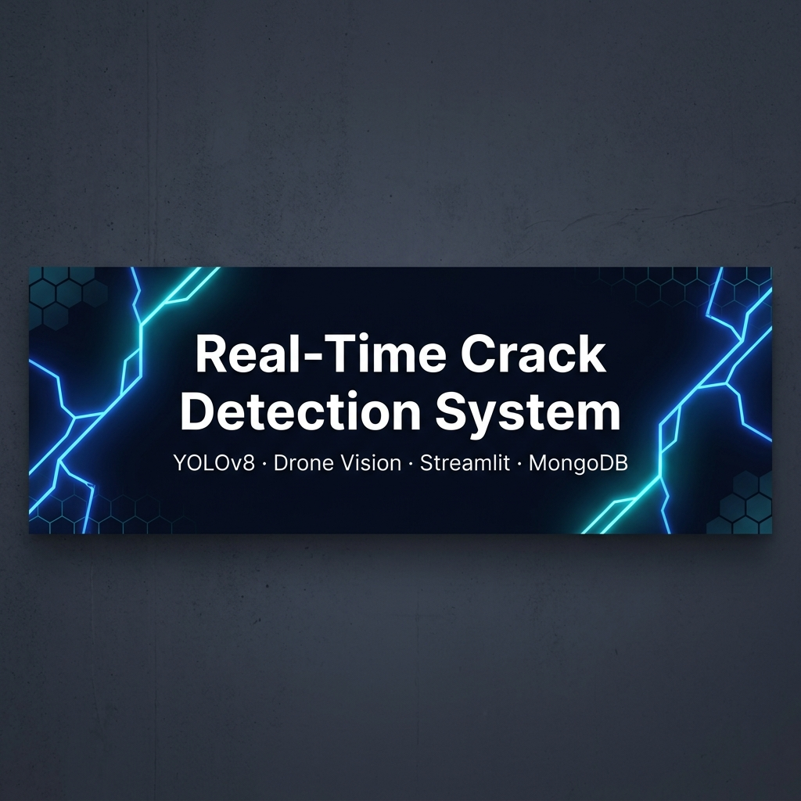
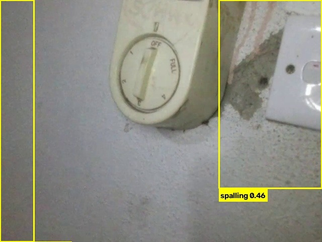
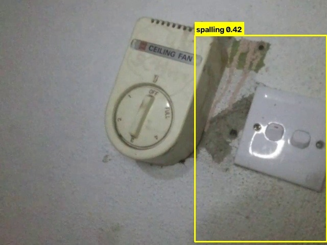
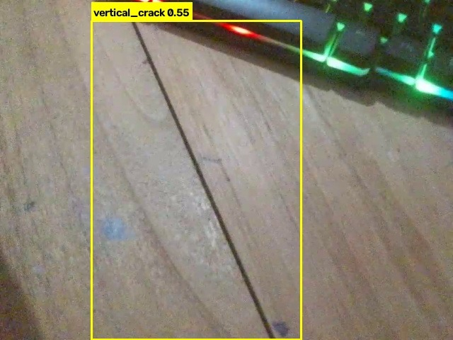

# 🚁 Real-Time Crack Detection System

> A **Streamlit-based web application** for real-time concrete crack detection using **YOLOv8** and **DJI Tello drone** live video feed.

---

## 🖼️ Detection Examples

<table>
  <tr>
    <td align="center"><br/><b>Spalling (0.46)</b></td>
    <td align="center"><br/><b>Spalling (0.42)</b></td>
    <td align="center"><br/><b>Vertical Crack (0.55)</b></td>
  </tr>
</table>

---

## ✨ Features

- 🚁 **DJI Tello Drone** live video stream integration
- ⚡ **Real-time YOLOv8 inference** — detects 8 concrete defect types
- 🎯 **Severity classification** — Low / Medium / High based on confidence
- 🗄️ **Dual database logging** — MongoDB + MySQL support
- 🖼️ **Auto-saves** annotated detection frames to `uploads/`
- 📊 **Live FPS counter** display
- 🔋 **Drone battery** monitor in sidebar

---

## 🔍 Detectable Defect Classes

| # | Class | Description |
|---|-------|-------------|
| 1 | 🔴 Diagonal Crack | Angled structural cracks |
| 2 | 🔴 Vertical Crack | Top-to-bottom cracks |
| 3 | 🔴 Horizontal Crack | Side-to-side cracks |
| 4 | 🟡 Spalling | Surface concrete breaking off |
| 5 | 🟡 Seepage | Water leakage stains |
| 6 | 🟡 Surface Defect | General surface damage |
| 7 | 🟠 Exposed Rebar | Visible rusted steel rods |
| 8 | 🟠 Void | Hollow gaps in concrete |

---

## 🗂️ Project Structure

```
CrackDetection app/
│
├── app.py              # 🚀 Main Streamlit app entry point
├── detect.py           # YOLOv8 inference logic
├── drone_camera.py     # DJI Tello camera interface
├── preprocess.py       # Frame preprocessing pipeline
├── db_control.py       # Database save controller
├── mongo_db.py         # MongoDB connection
├── mysql_db.py         # MySQL connection
├── config.py           # App configuration (model path, thresholds)
├── fps.py              # FPS utility
├── draw boxes.py       # Bounding box drawing
├── preprocess.py       # Image preprocessing
│
├── 📁 model/           # YOLOv8 trained model weights (.pt)
├── 📁 uploads/         # Auto-saved detection frame images
├── 📁 utils/
│   ├── fps.py          # FPS counter utility
│   └── draw_boxes.py   # Box annotation utility
│
├── requirements.txt    # Python dependencies
└── .env                # Environment variables (DB credentials)
```

---

## ⚙️ Setup & Installation

### 1. Clone the Repository
```bash
git clone https://github.com/Viduladhanasekara/yolo_training-.git
cd "yolo_training-"
git checkout crackdetection-app
```

### 2. Install Dependencies
```bash
pip install -r requirements.txt
```

### 3. Configure Environment Variables
Create a `.env` file:
```env
MODEL_PATH=model/best.pt
CONF_THRESHOLD=0.4
CAMERA_ID=drone_01
UPLOADS_DIR=uploads

# MongoDB
MONGO_URI=mongodb://localhost:27017/
MONGO_DB=crack_detection

# MySQL
MYSQL_HOST=localhost
MYSQL_USER=root
MYSQL_PASSWORD=yourpassword
MYSQL_DB=crack_detection
```

### 4. Run the App
```bash
streamlit run app.py
```

---

## 🎮 How to Use

| Step | Action |
|------|--------|
| 1️⃣ | Power on your **DJI Tello drone** & connect PC to drone WiFi |
| 2️⃣ | Click **🟢 Connect Drone** button |
| 3️⃣ | Click **▶️ Live Feed ON** to start detection |
| 4️⃣ | Enable **MongoDB / MySQL** to log detections |
| 5️⃣ | Click **⏸️ Live Feed OFF** → **🔴 Disconnect** when done |

---

## 📦 Dependencies

```
streamlit          # Web UI framework
djitellopy         # DJI Tello drone SDK
ultralytics        # YOLOv8
opencv-python      # Video frame processing
numpy              # Array operations
pymongo            # MongoDB driver
mysql-connector-python  # MySQL driver
python-dotenv      # .env file loader
```

---

## 🛠️ Tech Stack


---

## 📁 Related Repository

> 🔗 **Training Dataset & YOLO Training Scripts** →
> [`main` branch](https://github.com/Viduladhanasekara/yolo_training-/tree/main)

---

## 👤 Author

**Vidula Dhanasekara**
Final Year Project — Real-Time Concrete Crack Detection using YOLOv8 & Drone Vision

---

> ⭐ *Star this repo if you find it useful!*
