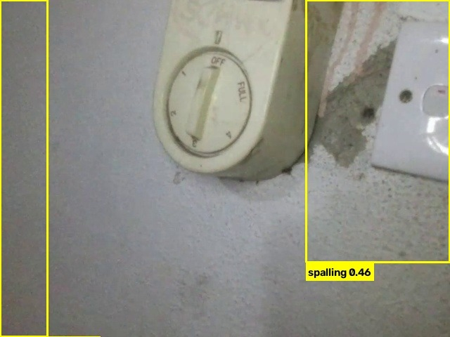

# 🏗️ Concrete Crack & Defect Detection System

A **YOLOv8-powered** deep learning system for real-time detection of concrete surface defects — built for drone-based structural inspection.

---

## 🔍 What It Does

This system detects **8 types of concrete defects** from images or live drone video using a custom-trained YOLOv8 model:

| Defect Class | Description |
|---|---|
| 🔴 **Diagonal Crack** | Cracks running at an angle |
| 🔴 **Vertical Crack** | Top-to-bottom structural cracks |
| 🔴 **Horizontal Crack** | Side-to-side surface cracks |
| 🟡 **Spalling** | Concrete surface breaking/flaking off |
| 🟡 **Seepage** | Water leakage stains |
| 🟡 **Surface Defect** | General surface damage |
| 🟠 **Exposed Rebar** | Rusted steel reinforcement visible |
| 🟠 **Void** | Hollow gaps in concrete |

---

## 🖼️ Detection Examples

<table>
  <tr>
    <td align="center"><br/><b>Spalling Detection (0.46)</b></td>
    <td align="center"><br/><b>Spalling Detection (0.42)</b></td>
    <td align="center"><br/><b>Vertical Crack Detection (0.55)</b></td>
  </tr>
</table>

---

## 🗂️ Project Structure

```
Crack_defect_project/
│
├── 📁 dataset/            # Training & validation images + YOLO labels
│   ├── images/
│   │   ├── train/
│   │   └── valid/
│   └── labels/
│       ├── train/
│       └── valid/
│
├── 📁 raw_images/         # Original collected images per defect class
│   ├── diagonal_crack/
│   ├── vertical_crack/
│   ├── horizontal_crack/
│   ├── spalling/
│   ├── seepage/
│   ├── surface_defect/
│   ├── exposed_rebar/
│   └── void/
│
├── 📁 runs/               # YOLOv8 training results & predictions
│   └── detect/
│       ├── train/         # Training metrics, curves, confusion matrix
│       └── predict/       # Inference outputs
│
├── 📁 scripts/
│   ├── split_dataset.py   # Train/val split script
│   ├── live_detect.py     # Live webcam/drone detection
│   └── check_camera.py    # Camera connection test
│
├── 📁 weights/            # Saved custom model weights
├── dataset.yaml           # YOLO dataset config
├── yolov8n.pt             # YOLOv8 Nano base model
└── yolov8s.pt             # YOLOv8 Small base model
```

---

## ⚙️ Setup & Run

### 1. Install Dependencies
```bash
pip install ultralytics opencv-python
```

### 2. Train the Model
```bash
yolo detect train data=dataset.yaml model=yolov8s.pt epochs=100 imgsz=640
```

### 3. Run Live Detection
```bash
python scripts/live_detect.py
```

### 4. Launch Drone App (Streamlit UI)
```bash
cd "../CrackDetection app"
pip install -r requirements.txt
streamlit run app.py
```

---

## 🚁 Drone App Features

The companion **Streamlit web app** (`CrackDetection app/`) provides:

- 📡 **DJI Tello drone** live video feed integration
- ⚡ **Real-time YOLOv8 inference** with bounding boxes
- 📊 **Severity classification** (Low / Medium / High)
- 🗄️ **MongoDB & MySQL** detection logging
- 🖼️ **Auto-saves** annotated detection frames

---

## 📊 Model Performance

Training results are saved in `runs/detect/train-*/`:
- Confusion matrix
- Precision-Recall curves
- F1 score curve
- Validation predictions

---

## 🛠️ Tech Stack


---

## 👤 Author

**Vidula Dhanasekara**  
Final Year Project — Concrete Defect Detection using YOLO & Drone Vision  

---

> ⭐ *Star this repo if you find it useful!*
